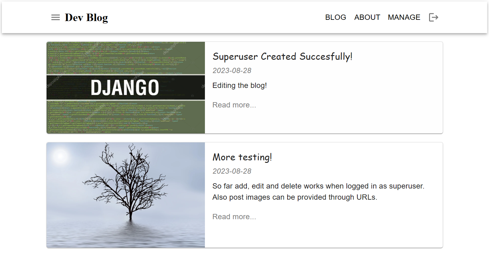

# Dev Blog

## Description

A simple blog with basic functions based on Django, React, MUI and MongoDB. Also Django REST framework is used to authenticate users with editing privileges.



## Installation

Step 1:

Clone the project. Python and pip are required. Also virtual environment is recommended. You can create and activate one using commands

```
python3 -m venv .venv
source .venv/bin/activate
```

Step 2: Install necessary python and node packages

```
pip install -r requirements.txt
npm install
```

Step 3: Compile JavaScript into static bundle that is used by Django templates. You need to do this everytime you change something in JS code.

```
npm run dev
```

Step 4: Install and configure MongoDB. When succesfully installed, database can be run with following command

```
mongod --dbpath "YOUR DATABASE PATH"
```

Step 5: Apply migrations to the database and create your Django superuser that you can use to manage your blog content
```
python manage.py makemigrations
python manage.py migrate

python manage.py createsuperuser
```

Step 5: Run the server
```
python manage.py runserver
```

